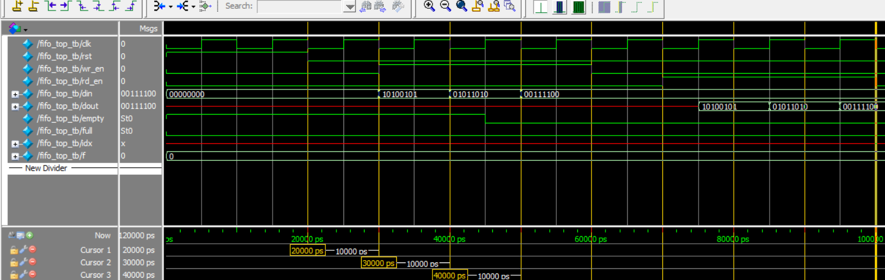

# 📦 Verilog Synchronous FIFO (同步式先進先出緩衝器)

這個專案實作了一個**同步式FIFO**，包含以下元件：
- FIFO 控制器（fifo_ctrl.v）
- FIFO 記憶體（fifo_mem.v）
- 頂層組合模組（fifo_top.v）
- 測試平台（fifo_top_tb.v）

---

## 🛠️ Tools Used
- ModelSim – for simulation and waveform viewing
- Quartus Prime – RTL design and schematic generation
- Verilog HDL – Hardware description language

---

## 📂 Files Included

| File | Description |
|:-----|:------------|
| `fifo_ctrl.v` | FIFO控制邏輯 (控制寫入、讀出、計數、滿/空旗標) |
| `fifo_mem.v`  | FIFO記憶體 (以陣列方式存放資料) |
| `fifo_top.v`  | FIFO頂層整合模組 |
| `fifo_top_tb.v` | 測試平台 (Testbench) |
| `monitor_log.txt` | 模擬的文字輸出紀錄 |
| `wave_fifo_top_tb.bmp` | ModelSim波形圖 |
| `RTL_FIFO Block Diagram.pdf` | Quartus產生的RTL架構圖 |

---

## 📊 RTL Block Diagram
> RTL結構由Quartus Prime產生，顯示FIFO的組成與資料流向

📎 **[點此查看RTL Block Diagram (PDF檔案)](./RTL_FIFO%20Block%20Diagram.pdf)**

---

## 🎯 Simulation Waveform
> 透過ModelSim模擬，顯示FIFO的寫入與讀出行為。

📎 **View Waveform**  


---

## 🧪 Simulation Example (from monitor_log.txt)

```plaintext
=== FIFO Write Phase ===
@ 10ns: Write din = 0xAA
@ 20ns: Write din = 0x55
@ 30ns: Write din = 0x3C

=== FIFO Read Phase ===
@ 50ns: Read dout = 0xAA
@ 60ns: Read dout = 0x55
@ 70ns: Read dout = 0x3C

Simulation finished successfully!
✅ Result
所有功能（寫入、讀出、滿/空檢查）均通過測試
